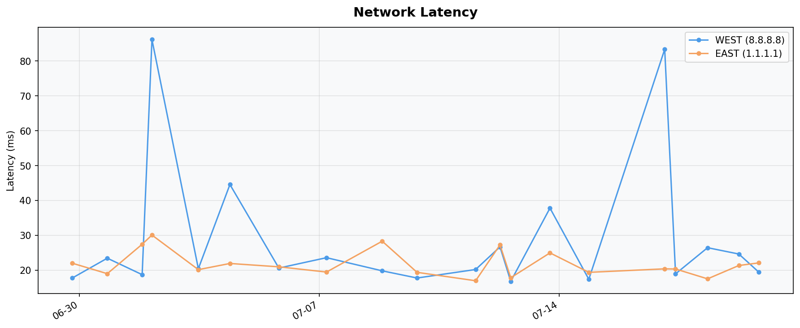

# workflows

A lightweight network latency monitor that runs locally on macOS and logs ping results to GitHub daily. Uses **launchd** instead of cron so jobs execute when the Mac wakes from sleep rather than being silently skipped.

## Latency Chart



*Updated automatically on each push to `ping.log`.*

## What it does

- Pings `8.8.8.8` (Google DNS) and `1.1.1.1` (Cloudflare DNS) every 4 hours while the Mac is awake
- Records average round-trip latency for each as **WEST** and **EAST**
- Appends each result to `~/Library/Logs/ping.log`
- Copies `ping.log` into this repo, commits, and pushes to GitHub once a day

## Files

### Repo (reference copies)

| File | Description |
|------|-------------|
| `ping_check.sh` | Source copy of the ping script |
| `git_sync.sh` | Source copy of the sync script |
| `ping.log` | Latency log synced from the Mac and committed daily |

### On the Mac (active locations)

| Path | Description |
|------|-------------|
| `~/bin/ping_check.sh` | Deployed ping script — run by launchd every 4 hours |
| `~/bin/git_sync.sh` | Deployed sync script — run by launchd every 24 hours |
| `~/Library/Logs/ping.log` | Live log file written by `ping_check.sh` |
| `~/Library/LaunchAgents/com.cliff.pingcheck.plist` | launchd agent for ping checks |
| `~/Library/LaunchAgents/com.cliff.gitsync.plist` | launchd agent for GitHub sync |

## Log format

Each line in `ping.log` follows this format:

```
YYYY-MM-DD HH:MM:SS | WEST=<ms>ms | EAST=<ms>ms
```

Example:
```
2026-06-29 18:54:53 | WEST=17.718ms | EAST=21.977ms
```

## launchd agents

Both scripts run as launchd agents stored in `~/Library/LaunchAgents/`. Unlike cron, launchd fires missed jobs when the Mac wakes from sleep.

| Agent | Plist | Interval |
|-------|-------|----------|
| `com.cliff.pingcheck` | `com.cliff.pingcheck.plist` | Every 4 hours |
| `com.cliff.gitsync` | `com.cliff.gitsync.plist` | Every 24 hours |

Check agent status:
```bash
launchctl list | grep com.cliff
```

Logs for debugging:
```
~/Library/Logs/pingcheck.err.log
~/Library/Logs/gitsync.err.log
```

## Setup (if re-cloning)

1. Clone the repo
2. Copy the scripts to `~/bin/` (outside TCC-protected Desktop so launchd can access them):
   ```bash
   mkdir -p ~/bin
   cp ping_check.sh git_sync.sh ~/bin/
   chmod +x ~/bin/ping_check.sh ~/bin/git_sync.sh
   ```
3. Update the `REPO` path in `~/bin/git_sync.sh` to your local clone path
4. Create and load the launchd plist files (see `~/Library/LaunchAgents/com.cliff.pingcheck.plist` and `com.cliff.gitsync.plist`)
